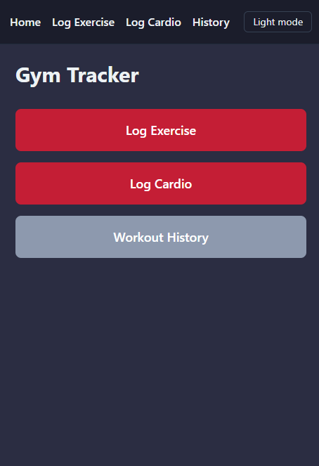
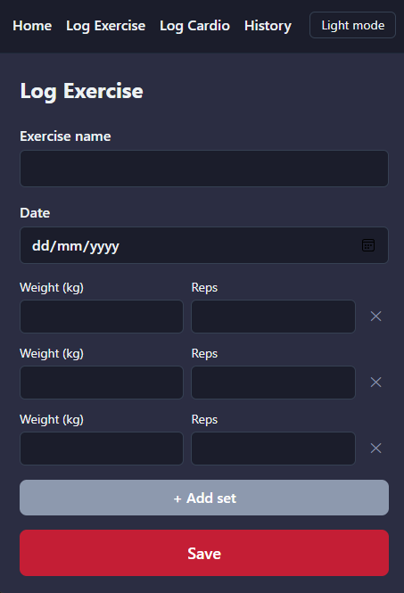
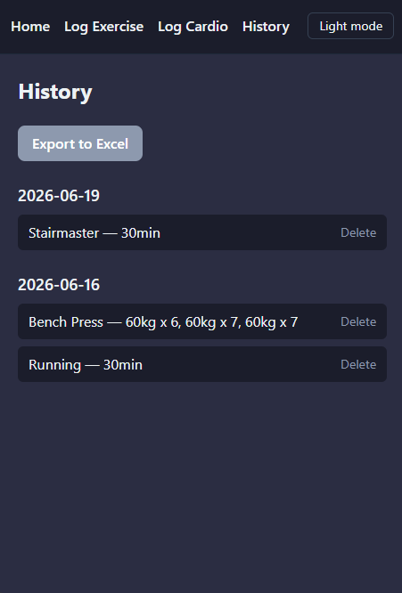

# Gym Tracker

A cross-platform gym tracking app built from scratch in Rust, running natively on Android (and desktop, for development) via Dioxus. Log weight training and cardio sessions, follow preset workout templates, track personal records and bodyweight, view progress graphs, review your history grouped by day, and export everything to Excel.

Built as a learning project to go from zero Rust/mobile experience to a complete, working, portfolio-quality app, including the full toolchain, architecture, and Git workflow.

## Features

- **Log Exercise** - record an exercise with any number of sets, each with its own weight and reps. Exercise names autocomplete from previous entries.
- **Log Cardio** - record activity, duration, and date, with optional details (distance, incline, average speed, calories, floors climbed) for machines like treadmills and stairmasters.
- **Start Workout** - preset Push/Pull/Upper/Legs templates with rep ranges, rest times, and notes. Each exercise pre-fills with the sets you logged last time, defaults to 3 sets otherwise. Reorder or swap exercises inline, suggests the next day in your rotation based on what you completed last.
- **Workout History** - view everything you've logged, grouped by date, with sets for the same exercise grouped together. Soft-delete with a confirm step.
- **Personal Records** - heaviest set and highest rep count ever logged per exercise, with dates.
- **Bodyweight tracking** - simple weight-over-time log, separate from exercise/cardio data.
- **Progress graphs** - line chart of weight over time for any exercise, built as hand-drawn SVG.
- **Excel Export** - export your full history to a `.xlsx` file with three sheets: a combined overview (including daily average weight/reps per exercise), a detailed exercise sheet, and a detailed cardio sheet. Saves to the public Downloads folder on Android so it can be shared straight to Google Drive.
- **Dark mode** - manual toggle, defaults to dark, shared across every screen.

## Screenshots





## Tech stack

- **[Rust](https://www.rust-lang.org/)** - the application language, end to end
- **[Dioxus](https://dioxuslabs.com/)** - cross-platform UI framework (this app targets Android and desktop)
- **[SQLite](https://www.sqlite.org/)** via **[SQLx](https://github.com/launchbadge/sqlx)** - local, on-device storage with compile-time-checked async queries and versioned migrations
- **[Tailwind CSS](https://tailwindcss.com/)** - styling, with a small custom design token palette
- **[rust_xlsxwriter](https://github.com/jmcnamara/rust_xlsxwriter)** - generates real `.xlsx` files for export

## Architecture
src/

├── db/            # data layer

├── views/         # one file per screen

├── components/    # shared UI pieces

└── main.rs        # entry point, routes, db init

migrations/        # versioned SQL, applied on startup

| Folder/file | Purpose |
|---|---|
| `src/db/` | Data layer: SQLite connection, migrations, and one module per feature (`exercises`, `cardio`, `history`, `export`, `templates`, `bodyweight`). UI code never writes SQL directly, it calls functions from here. |
| `src/views/` | One file per screen (Home, Log Exercise, Log Cardio, Start Workout, History, Records, Bodyweight, Progress), plus the shared Navbar layout and a small date-formatting helper. |
| `src/components/` | Shared, reusable UI pieces (currently empty, see [Roadmap](#roadmap)). |
| `src/main.rs` | App entry point, route definitions, database initialisation. |
| `migrations/` | Versioned SQL migration files, applied automatically on startup. |

### Database design

The schema is intentionally normalised and forward-compatible:

- Exercises are stored once and referenced by ID from logged sets, preventing duplicate or inconsistent names.
- Every log table has a nullable `session_id` (for grouping a day's workout), a nullable `deleted_at` (soft delete, nothing is ever hard-deleted), and a `created_at` audit timestamp.
- Cardio's optional fields (incline, speed, calories, floors) are nullable columns rather than a rigid fixed shape, so different activities can use whichever fields are relevant.
- Workout templates store exercises by name rather than by ID, keeping a template independent of whether that exact exercise has ever been logged, the underlying `exercises` row is created automatically the first time it's saved.

This was a deliberate choice to support features like personal records, progress graphs, and workout templates without requiring a schema rewrite as each one was added.

## Getting started

### Prerequisites

- [Rust](https://rustup.rs/) (stable)
- [Dioxus CLI](https://dioxuslabs.com/learn/0.7/getting_started): `cargo install dioxus-cli --locked`
- For Android builds: Android Studio, SDK, and NDK, plus the `aarch64-linux-android` Rust target (`rustup target add aarch64-linux-android`)

### Run on desktop (fastest for development)

```bash
dx serve --desktop --no-default-features
```

### Run on a connected Android device

```bash
dx serve --android --device <your-device-id>
```

Find your device ID with `adb devices` once USB debugging is enabled.

## Database

SQLite is the only persistent store, all data lives in a single file in the app's private storage, created and migrated automatically on first launch. Excel export is export-only, it never reads back into the app.

## Power BI / Tableau

Both tools can connect directly to the exported `.xlsx` file as a data source, the Overview, Exercises, and Cardio sheets are already in a flat, long-format shape suited to building dashboards or pivot tables in either tool. No further integration work is required for basic use, a live database connection (rather than a file) would be a separate, larger undertaking.

## Known limitations

- **Android hardware/gesture back button exits the app** rather than navigating to the previous screen. This is a current limitation in Dioxus's underlying webview layer (the back button event isn't forwarded to the app), not something fixable from application code alone. Use the in-app back arrow in the navbar instead.

## Roadmap

Planned future work:

- [ ] Exercise images and descriptions
- [ ] Exercise categories / muscle groups
- [ ] Full Android Share Sheet integration for export (currently saves to Downloads, shareable manually)
- [ ] Native handling of the Android back button (requires native Activity code via JNI, deferred for the same reasons as the Share Sheet)
- [ ] Cloud sync and user accounts

## License

MIT, see [LICENSE](LICENSE).